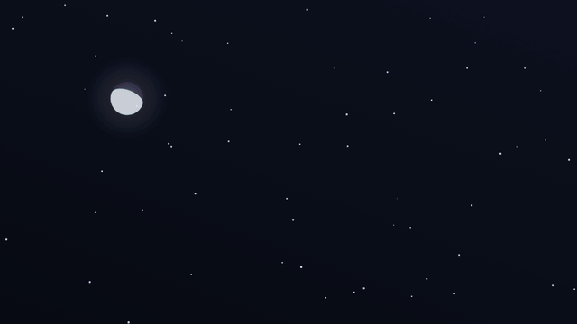
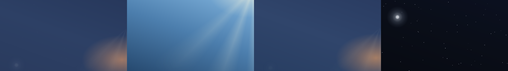
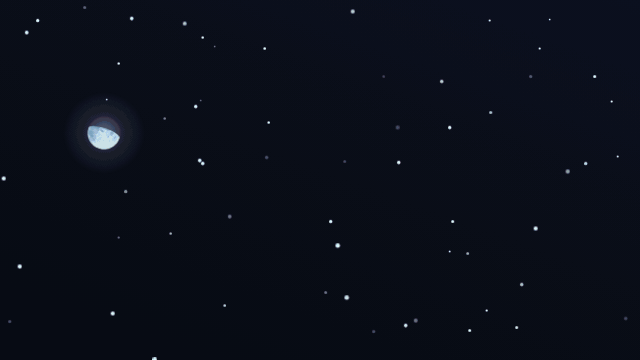
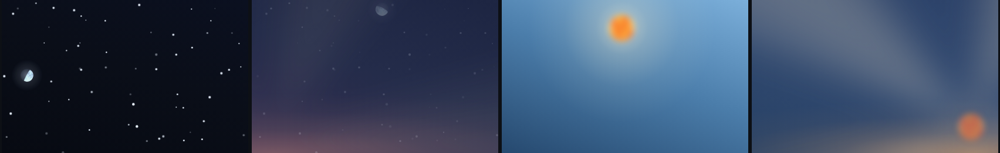

# Sun Cycle Background



*The sun on its real arc: night, dawn, noon, sunset (52° N, early September):*



A living day-cycle background for Home Assistant dashboards. One invisible
Lovelace card paints the whole view from the **real position of the sun and
moon**, and keeps it gently moving around the clock:

- **Sky** — the gradient shifts continuously through night → dawn → sunrise →
  golden hour → noon and back. Palette is interpolated between
  elevation-keyed anchors, so seasons and latitudes work automatically
  (a winter noon simply never reaches the full-noon palette).
- **Sun on its real diurnal arc** — `sun.sun` publishes both `azimuth` and
  `elevation`, so the sun rises in the east, culminates in the south and sets
  in the west along a path tilted by (90° − your latitude), exactly like the
  sky outside. The arc flattens in winter and towers in summer on its own,
  because the data does.
- **Twilight glow that stays at the horizon** — the scattered light of dusk
  and dawn is a wide, flat band along the bottom of the sky, centred on the
  sun's azimuth. It widens as the sun sinks (light scatters along the whole
  horizon, not just towards the sun) and fades out before its centre can drift
  off-frame. The disc keeps its own aureole, which grows back to its full
  daytime size above ~14°, so broad daylight looks exactly as it did.
- **Crepuscular rays** — a wide, blurred fan spreads from the sun near the
  horizon and, as the sun climbs, fades smoothly (smoothstep over 0–22° of
  elevation) into a plain aureole. No hard edges, no visible switch, nothing
  left once the sun is well below the horizon.
- **Moon with its own ephemeris** — position *and* phase are computed from a
  compact lunar series, so the moon keeps its own schedule instead of
  mirroring the sun (on a given night it may be up for 8 hours while the sun
  was up for 14), and it is drawn as the actual crescent / half / gibbous
  shape, bright limb facing the sun.
- **Planets** — the other eight bodies of the solar system stand where they
  really stand. The [Sol](https://github.com/okkine/HA-Sol) integration
  publishes `sensor.sol_<body>_azimuth` and `_elevation`; the card puts each
  planet's own picture on the same projection as the sun and the moon, fading
  it in as the sky darkens and out as it sets. Sizes are emblems, not scale —
  see [Planets](#planets).
- **Stars** — a field of twinkling stars moving **east to west**, like the
  sky. Cheap linear drift by default; optional rotation about the celestial
  pole (`stars.rotate: true`) for real arcs. On top of it, all opt-in: three
  star sizes, a few **flare** stars that flash now and then, **meteors** (or a
  shower from a radiant), and the **ISS** crossing the sky along its real pass
  when the Satellite Tracker integration publishes one — see
  [Flares, meteors and the ISS](#flares-meteors-and-the-iss).

Because everything is keyed to solar elevation, the panel on your wall
matches the sky outside your window: pink dawn at dawn, golden hour at
golden hour, stars at night.

## Performance

Designed for wall-mounted kiosk tablets:

- every animation is **transform/opacity only** — runs entirely on the
  compositor, no layout, no paint, no JS animation loops,
- one animated layer each for rays, moon and stars — and the ray fan **leaves
  the tree entirely** once the sun is far enough below the horizon, so it costs
  nothing at night (a fan faded to `opacity: 0` still holds its layer, and an
  animated layer forces every element painted above it into a layer of its own),
- the palette repaints only when the sun moves ≥ 0.15° in elevation or ≥ 0.6°
  in azimuth (about every half minute),
- the star field is 5 painted nodes per copy — 10 for the drifting strip, 5
  when rotating (multi-point `box-shadow` stars, group-level twinkle),
- the whole astronomy pass is a few dozen floating-point operations per
  repaint — no dependencies, no network.

Measured with this card running on a 1280×400 Raspberry Pi 5 kiosk (32-bit
Chromium, blur enabled): **60 fps**.

A note for weak GPUs: an animated layer promotes everything drawn above it
(Chromium calls the reason *overlap*). On a busy dashboard that can add up to
more layer memory than the device holds, and the symptom is individual cards
blinking — the transparent ones first, because they can never merge into the
root layer. If you meet that, `stars.drift: 0` removes the widest animated
layer while keeping the field itself.

`stars.rotate: true` is the one option with a real cost. Rotating a field
about the pole means the layer has to cover the entire disc it sweeps, which
is several times the frame area, so the star count scales up to keep the same
on-screen density. Fine for panel-sized views; skip it on a 4K dashboard.

## Install

### HACS (custom repository)

1. HACS → menu → *Custom repositories* → add this repo URL, category
   **Dashboard** (Lovelace).
2. Install **Sun Cycle Background**, reload resources when prompted.

### Manual

1. Copy `sun-cycle-bg.js` to `/config/www/`.
2. Add a dashboard resource: URL `/local/sun-cycle-bg.js`, type
   **JavaScript module**.

### Optional: the real ISS

`stars.iss: true` needs the pass sensors. Install
[Satellite Tracker](https://github.com/djtimca/hasatellitetracker) (HACS
integration, N2YO API key) and let it create `sensor.iss_visual_pass_0..4` —
the card reads `pass_start_unix`, `pass_end_unix`, `max_elevation`,
`start_compass` and `end_compass` from their attributes. Without the sensors
the option is harmless: nothing flies.

### Optional: the planets

`planets: true` needs the [Sol](https://github.com/okkine/HA-Sol) integration
(HACS) — it creates `sensor.sol_<body>_azimuth` and `sensor.sol_<body>_elevation`
for Mercury, Venus, Mars, Jupiter, Saturn, Uranus, Neptune and Pluto, and the
card reads exactly those two states per body. Without the integration the
option is harmless: nothing is drawn. You also need one picture per planet
under `/local/` — see [Planets](#planets).

### Upgrading from 1.4

Nothing to change. `planets:` is off by default, so a 1.4 config draws exactly
what it drew.

### Upgrading from 1.3

Nothing to change. Every option added in 1.4.0 is off by default, so a 1.3
config draws exactly what it drew. If you ran a separate star card next to
this one with `stars: false`, delete that card and move its numbers under
`stars:` — the knob names are the same (`count`, `drift`, `sizes`, `size`,
`glow`, `twinkle`, `flares`, `meteors`, `iss`).

## Usage

Add the (invisible) card to every view you want painted — e.g. at the end of
a column, or via a shared include / dashboard generator:

```yaml
type: custom:sun-cycle-bg-card
```

All options, with defaults:

```yaml
type: custom:sun-cycle-bg-card
sun_entity: sun.sun     # any entity with `elevation` (and ideally `azimuth`)
twilight_palette: false # true = warmer amber dusk anchors instead of mauve
azimuth: [50, 310]      # sky window mapped across the frame, degrees
rays:
  blur: 28              # px of blur on the ray fan; 0 disables the filter
  strength: 0.5         # peak ray opacity, reached at the horizon
moon: true              # false hides the moon entirely
stars:                  # `stars: false` disables the built-in field
  count: 90             # stars visible on screen
  drift: 1800           # seconds per screen-width of drift, 0 = static
  rotate: false         # true = rotate about the celestial pole instead
  sizes: flat           # mixed = three diameters, a crude magnitude ladder
  size: 1               # scales the star dot (0.25–2)
  glow: 1               # scales the blur around it (0–2); 0 = hard pixels
  twinkle: 1            # amplitude (0–1.4); 0 = steady
  flares:               # a few stars that flash bright now and then
    count: 0
    every: 26           # seconds per cycle (each star ±25 %)
    strength: 1         # 0–1
    spikes: true        # diffraction spikes on the flash
  meteors:              # sporadic streaks on a Poisson interval
    rate: 0             # per hour; 0 = off
    length: 190         # px
    speed: 1.1          # seconds per streak
    angle: 24           # degrees below horizontal (random ±8)
    radiant: null       # [x%, y%] = a shower, every streak runs from there
    pair: 0             # chance (0–1) of a second streak right after
  iss: false            # true = the real ISS from sensor.iss_visual_pass_0..4
planets: false          # true = the eight from the Sol integration, or:
# planets:
#   entities: sensor.sol_   # prefix, + <body>_azimuth / _elevation
#   bodies: [mercury, venus, mars, jupiter, saturn, uranus, neptune, pluto]
#   images: /local/sun-cycle/planets/   # + <body>.png
#   files: {}             # per-body override: {saturn: /local/mine.png}
#   size: 2.4             # Jupiter's disc, % of the view width
#   scale: {}             # per-body multiplier of that
#   discs: {}             # per-body [dia, cx, cy] of the disc inside the file
#   names: {}             # per-body caption
#   labels: false         # name under the disc
#   glow: 0.5             # 0–2; a hair of halo so it is not a sticker
#   min_elevation: 0      # fade out below this altitude
#   day: false            # true = keep them up in daylight too

# Optional artwork for the two discs — see below. Left out, both stay drawn.
sun_image: null         # e.g. /local/sun-cycle/sun.png
sun_image_width: 10.5   # disc diameter, % of the view width
sun_image_blur: 11.5    # % of that diameter, not px; 0 disables the blur
sun_image_disc: [1, 0.5, 0.5]
moon_image: null
moon_image_width: 0     # 0 keeps the CSS default (15%, capped at 190 px)
moon_image_disc: [1, 0.5, 0.5]
```

## Drawing the discs from your own artwork

The sun has no drawn disc: by default it *is* the aureole and the ray fan. The
moon is drawn as a circle with the real terminator. Point `sun_image` and
`moon_image` at your own files and those places are taken over by pictures,
while every glow stays rendered — the twilight band, the disc aureole, the ray
fan and the moon halo. The two options are independent.

**No artwork ships with the card.** These are paths to your files (`/local/...`),
so the card itself carries no images and you keep whatever licence your own
artwork has. The two PNGs under `demo/assets/` exist only to drive
`demo/images-poc.html`; they are the repository owner's own artwork and fall
under this repository's MIT licence like the rest of it.

`*_image_disc` is `[diameter / image width, cx / image width, cy / image
height]` — where the disc actually sits inside the file. Artwork rarely fills
its frame: a sun render carries rays sticking out on one side, a moon render
carries a baked glow. Placing such a file by its own centre puts the disc
beside its aureole, so measure the disc from the alpha channel and pass it
here. The default `[1, 0.5, 0.5]` means a disc filling a square image.



*The same four phases with `sun_image` and `moon_image` set — night, dawn,
noon, sunset (52° N, 3 September, a 65 %-lit moon):*



Two details that are not obvious:

- **Blur is a share of the disc diameter, never a pixel figure.** The same card
  runs in a 430 px card and on a 1920 px kiosk, and a pixel value tuned in one
  is four times wrong in the other. A sharp-edged disc reads as a sticker
  pasted on the sky; something around 10 % of the diameter looks like a sun.
- **The sun disc fades out below −3° elevation.** The projection parks anything
  under the horizon on the bottom edge instead of pushing it out of frame, so
  an un-faded disc would sit there glowing all night.

Both discs are graded to the sky palette — the sun reddens and dims towards the
horizon, the moon pales at dusk and reaches full brightness deep in the night —
so a flat image does not read as pasted on. The moon image is clipped by the
terminator, so the phase still shows with the artwork as the lit texture; the
mask turns towards the sun while the image counter-rotates, keeping the maria
upright.

The default azimuth window (50° → 310°) assumes the frame looks south: east
on the left, west on the right, wide enough that a midsummer sunrise (67°)
and sunset (293°) both land inside the frame. Narrow it to zoom in on the
southern sky, or flip the two numbers for a north-facing view.

The moon needs your coordinates; it reads them from Home Assistant's own
configuration (`hass.config.latitude` / `longitude`), so there is nothing to
set up.

If your dashboard already has its own star layer with the element id
`star-twinkle-layer`, its opacity is driven too (fades at dawn, returns at
dusk) — set `stars: false` to avoid doubling the field.

## Planets

```yaml
planets: true           # everything below has a default
```

**Where they are.** Two states per body from the
[Sol](https://github.com/okkine/HA-Sol) integration — `sensor.sol_saturn_azimuth`
and `sensor.sol_saturn_elevation` — projected exactly like the sun and the
moon: azimuth across the frame, elevation up it. Nothing is computed in the
card. A planet below `min_elevation` fades out instead of sitting parked on
the bottom edge all night, and one outside the `azimuth:` window fades out
instead of piling up on the rim.

**When they are visible.** They ride the same curve as the stars: fully out in
daylight, fully in once the sun is about 9° below the horizon. `day: true`
keeps them up around the clock, which is not astronomy but is sometimes what a
dashboard wants.

**How big.** Not to scale, and it cannot be: Jupiter is at best 45 arcseconds
across, which on a 1280 px view spanning 260° of azimuth is a twentieth of a
pixel. A naked-eye planet *is* a point of light. So each disc is a small
emblem: `size` is Jupiter's diameter as a percentage of the view width (2.4 %
≈ 31 px on a 1280 px kiosk), and everything else is a multiple of it through
`scale`. The defaults rank the bodies by how bright they are in the sky rather
than by true diameter, which is why Venus outranks Uranus.

**The pictures.** No artwork ships with the card, exactly as for the sun and
the moon: `images` is a directory of yours holding `<body>.png`, one per body
named the way the Sol entities are (`jupiter.png`, `saturn.png`, …), or
`files` overrides individual paths. They want transparent backgrounds.
`tools/cutout_planets.py` makes them from renders on a black sky:

```bash
python3 tools/cutout_planets.py ~/Pictures/planets out/ --size 256
```

It thresholds the sky away, keeps the largest connected component (the planet
with its rings, never a star), fills the holes, feathers the limb by a pixel,
and fits a circle to the silhouette by RANSAC to find the **ball** inside the
file. That last number matters: a bounding box would measure Saturn's rings
(0.95 of the file instead of 0.43) and shrink the planet to a quarter of
everyone else, and a distance transform would measure the lit crescent of a
half-shadowed Mars. Inside the fitted circle the cutout is fully opaque, so a
night side stays dark instead of showing sky through it, while the rings stay
translucent. The script prints — and writes to `discs.json` — the
`[diameter, cx, cy]` triples; the card ships those numbers for these files as
its defaults, and `discs:` overrides them for your own.

## Flares, meteors and the ISS

Everything beyond the plain field is off by default, so a config written for
an older version draws exactly what it drew. The field itself is five groups
of stars, each one painted once as a multi-point `box-shadow` with only the
group's opacity animating — cheap, but it means one opacity drives a whole
group, so the three things below are real elements of their own:

- **`sizes: mixed`** splits the count into three diameters (2 / 3 / 4 px,
  scaled by `size`), so the field reads as magnitudes rather than a uniform
  sprinkle. `size` and `glow` are separate knobs: a 3 px dot under 2–6 px of
  blur is what the eye reads as a 9 px blob. `size: 0.5, glow: 0.05` gives
  pin-pricks; `glow: 0` gives hard pixels (fine on a dense tablet screen,
  gone on a projector).
- **`flares`** — a few stars that flash bright for a moment every `every`
  seconds (±25 % per star, so they never flash together), with or without
  diffraction `spikes`. Each is one element with its own keyframes.
- **`meteors`** — streaks spawned on a Poisson interval at `rate` per hour,
  each one element animated with the Web Animations API (transform + opacity)
  and removed when it finishes. Without `radiant` they fall at `angle` from
  anywhere; with `radiant: [x%, y%]` every streak runs away from that point,
  as a shower does. `pair` is the chance of a second streak right behind.
- **`iss`** — the station is not a star: it does not twinkle, moves at a
  steady pace and fades where it flies into the Earth's shadow. With the
  [Satellite Tracker (N2YO)](https://github.com/djtimca/hasatellitetracker)
  integration publishing `sensor.iss_visual_pass_0..4` (start/end unix, max
  elevation, start and end compass point), `iss: true` flies each pass at its
  real hour, along its real arc, for its real duration — projected the same
  way the sun and moon are, so it moves *through* the same sky. A view opened
  mid-pass joins the station in flight. "Visual pass" already means a sunlit
  station over a dark observer, and the layer's opacity is driven by the sun
  anyway, so nothing has to be gated by day and night on top of that.

  ```yaml
  iss:
    entities: sensor.iss_visual_pass_   # prefix; + 0 … count-1
    count: 5
    trail: 60        # px of trail behind the station, 0 = none
    label: true      # "ISS" caption next to it
    every: 0         # > 0 = demo passes every N seconds on the fallback arc
    duration: 330    # fallback arc (no sensors): seconds, azimuth from → to,
    az: [200, 95]    # peak altitude
    max_alt: 41
  ```

Timers only decide *when* a meteor or a pass starts; nothing animates in JS,
and both stop re-arming once the layer has left the document. A page that
wants to drive the layer itself (a tuning page) gets
`window.sunCycleBg.buildStars(cfg, W, H, proj)` and `readStarConfig(cfg)`;
the layer carries `scsMeteor()`, `scsIss()` and `scsStop()`.

## Tuning the palette

The whole look lives in one table at the top of `sun-cycle-bg.js` — `STOPS`:
seven anchors keyed by sun elevation (−18° … 52°), each holding the sky
gradient (3 × RGB), the sun halo colour (RGBA) and the star opacity.
Everything between anchors is linear RGB interpolation. Positions are no
longer in the table — the sun and moon are placed from their real coordinates.
Edit the numbers, bump your resource version, reload.

### Accuracy

The built-in astronomy is a low-precision series, and it is checked, not
assumed. Against Home Assistant's own `astral` values it lands within 0.24°
in elevation and 0.57° in azimuth, gives exactly 180.0° azimuth at solar
culmination, and reproduces HA's sunrise time to about 20 seconds. The lunar
series is checked against textbook geometry: 1.6° from the sun at new moon,
179.6° opposite at full moon. On a 1280 px frame, half a degree of azimuth is
about three pixels.

## Testing

`test/smoke.html` runs the card against stubbed view chrome at a frozen
instant (2026-08-28 23:43 UTC, 53.5° N) and prints the resulting sun/moon
positions, ray opacity, phase, the twilight band's geometry and — since
1.4.0 — the star layer: dot count and sizes, flares and their keyframes,
twinkle amplitude, drift/rotate, an on-demand meteor and an ISS pass joined
in flight from stubbed `sensor.iss_visual_pass_*` states. Since 1.5.0 it also
covers the planets: layer order, the disc offsets, and the four fades (below
the horizon, outside the azimuth window, daylight, and `day: true`) from
stubbed `sensor.sol_*` states. Open it in a
browser after changing anything, or run it headless:

```bash
python3 tools/run_smoke.py            # needs playwright + a chromium binary
```

It prints one JSON line per scene and the console errors it caught (expect
none). The numbers are meant to be read, not asserted: compare them with the
previous run and explain every difference before releasing.

Before a release the card also goes onto a real Home Assistant with a test
dashboard (a `panel` view holding the card, `sun_entity` pointed at a sensor
whose `elevation`/`azimuth` you set via `POST /api/states/...`), so the
lovelace resource, the view chrome and the layer order are the real ones.

## Demo

Open [`demo/simulator.html`](demo/simulator.html) in a browser. It runs the
same astronomy and the same placement the card uses, with sliders for time of
day, date and latitude, plus an autoplay button (full day in 60 s). Move the
latitude slider to watch the diurnal arc stand up towards the equator and lie
down towards the pole; move the date slider to watch it rise and fall with the
seasons.

The frames above were rendered from it — it accepts `?t=<minutes>`,
`?d=<day of year>`, `?lat=<degrees>`, `?seed=<n>` (deterministic stars),
`?bare=1` (just the scene, no chrome) and `?art=1` (discs drawn from
`demo/assets` instead of the render). `tools/render_docs.py` drives it
headlessly and rebuilds `docs/artwork.gif` and `docs/artwork.png`, so the
documentation cannot drift away from the code.

[`demo/images-poc.html`](demo/images-poc.html) is the page the artwork numbers
were tuned on: four ways of drawing the discs on one shared instant, with
sliders for disc size and blur.

[`tools/build_planets_poc.py`](tools/build_planets_poc.py) builds the same kind
of page for the planets (in Polish; the page itself is generated, not committed,
because the card is pasted into it). It inlines this very `sun-cycle-bg.js` and draws every scene
with the card's own `buildPlanets()`, on positions snapshotted from a live Sol
integration (`tools/sol_snapshot.py` → `demo/sol_snapshot.json`): a live panel
for size, glow, size ladder, fade threshold, labels and body selection, five
sizes side by side, the cutouts with their measured discs, and a table of
where every planet was. Rebuild it with `python3 tools/build_planets_poc.py`.

## How it works

The card renders nothing itself. On every sun update it:

1. maps the sun's azimuth and elevation onto the frame and paints
   `hui-view-background` with the interpolated sky plus the sun's aureole at
   that spot,
2. maintains three absolutely-positioned layers in `hui-view-container`,
   above the background and below every card: the star field right after
   `hui-view-background` (the farthest thing in the sky), then — inserted
   before `hui-view` — the ray fan, the planets and the moon (an inline SVG
   whose lit path is the real terminator). Flares live inside the star field;
   a meteor or the ISS is one extra element appended to it for the length of
   its flight; the planet layer is one `` per body, moved and faded, and
   carries its own scoped stylesheet so a tuning page can build it alone,
3. computes the moon's position and phase from the current time and the
   dashboard's coordinates,
4. injects its keyframe CSS once per shadow root.

Layers are deduplicated on re-create and die with their container — there is
deliberately no cleanup on disconnect, which would race view-to-view
navigation.

## Roadmap

Two things the sky outside does that this card does not. The card knows about
the sun, the moon, the stars and — since 1.5.0 — the planets, and nothing about
weather.

- ~~**Planets.**~~ A handful of naked-eye planets — Venus, Mars, Jupiter, Saturn —
  placed with the same projection as the sun and the moon, drawn as steady
  points (a planet does not twinkle; that is what tells it apart from a star at
  a glance), sized and haloed by apparent magnitude, optionally labelled the way
  the ISS is. Two ways to get the data: compute it in the card from the orbital
  elements in Paul Schlyter's [*How to compute planetary
  positions*](https://stjarnhimlen.se/comp/ppcomp.html) — under an arc minute
  for the inner planets, about one for the outer ones, magnitude formulas
  included, no dependencies — or read the sensors of the
  [HA-Sol](https://github.com/okkine/HA-Sol) integration (Skyfield + JPL DE421,
  positions but no magnitude). Computing it keeps the card self-contained, the
  way the lunar ephemeris already is. Note that "visible" is not a number either
  source provides: it has to be composed from *above the horizon* + *sun below
  about −6°* + *bright enough*.
  **Shipped in 1.5.0**, by the second route: the Sol integration's sensors,
  with pictures instead of magnitude-scaled points — see
  [Planets](#planets). Computing the positions in the card, and with them a
  real magnitude, is still open.
- **Clouds.** The sky is painted from solar elevation alone, so it is always
  clear. An optional `weather` entity could dim and desaturate the palette,
  soften the aureole and thin out the stars as cover rises — `cloudcover_percentage`
  from [AstroWeather](https://github.com/mawinkler/astroweather), or plain
  `cloud_coverage` from any HA weather entity. Cover should move slowly (a
  minutes-long transition, not a step), or the panel will flicker every time
  the forecast updates.
- **Weather effects.** Rain and snow over the whole scene, in the same spirit
  as the meteors: a handful of elements on compositor-only animations, spawned
  from the weather state and stopped when it clears, with wind bearing tilting
  the fall. This is the one item with a real performance budget question on a
  kiosk — it wants a measurement on the RPi5 before it ships, not after.

## License

MIT
