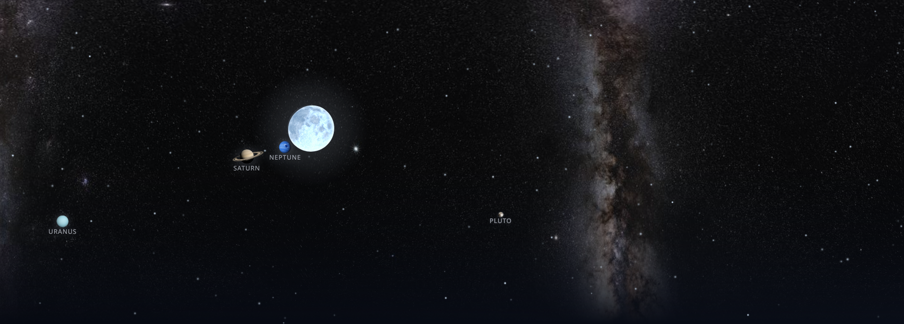
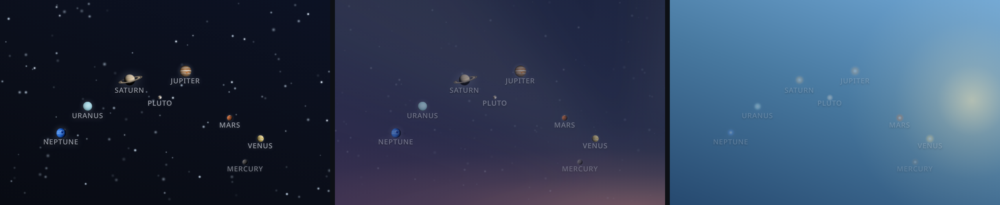
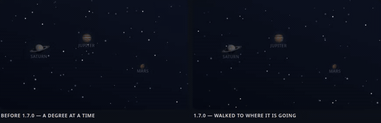
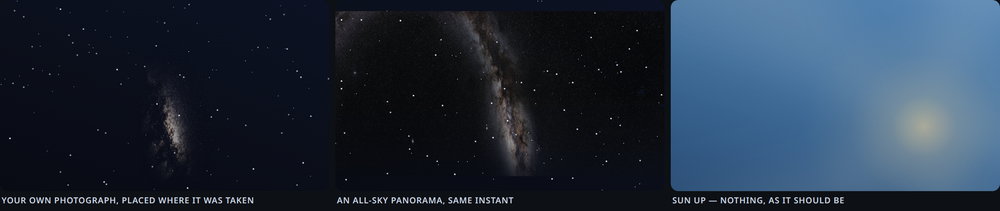

# Sun Cycle Background



*One frame, everything switched on: 2026-08-30 just after midnight at 53.5° N.
The band, the moon's phase and its place are computed for that clock; Saturn,
Neptune, Uranus and Pluto are where the Sol integration said they were.*


*The sun on its real arc: night, dawn, noon, sunset (52° N, early September):*


A living day-cycle background for Home Assistant dashboards. One invisible
Lovelace card paints the whole view from the **real position of the sun and
moon**, and keeps it gently moving around the clock:

- **Sky** — the gradient shifts continuously through night → dawn → sunrise →
  golden hour → noon and back. Palette is interpolated between
  elevation-keyed anchors, so seasons and latitudes work automatically
  (a winter noon simply never reaches the full-noon palette).
- **Sun on its real diurnal arc** — `sun.sun` publishes both `azimuth` and
  `elevation`, so the sun rises in the east, culminates in the south and sets
  in the west along a path tilted by (90° − your latitude), exactly like the
  sky outside. The arc flattens in winter and towers in summer on its own,
  because the data does.
- **Twilight glow that stays at the horizon** — the scattered light of dusk
  and dawn is a wide, flat band along the bottom of the sky, centred on the
  sun's azimuth. It widens as the sun sinks (light scatters along the whole
  horizon, not just towards the sun) and fades out before its centre can drift
  off-frame. The disc keeps its own aureole, which grows back to its full
  daytime size above ~14°, so broad daylight looks exactly as it did.
- **Crepuscular rays** — a wide, blurred fan spreads from the sun near the
  horizon and, as the sun climbs, fades smoothly (smoothstep over 0–22° of
  elevation) into a plain aureole. No hard edges, no visible switch, nothing
  left once the sun is well below the horizon.
- **Moon with its own ephemeris** — position *and* phase are computed from a
  compact lunar series, so the moon keeps its own schedule instead of
  mirroring the sun (on a given night it may be up for 8 hours while the sun
  was up for 14), and it is drawn as the actual crescent / half / gibbous
  shape, bright limb facing the sun.
- **The Milky Way** — a photograph of the band, put back on the sky where it
  belongs and rotating with it through the night. Nothing about the band can
  be computed — it is resolved star clouds and torn dust, and every analytic
  model of it comes out a grey smear — so the light is a photograph and the
  card only decides where each piece of it goes. Two ship with the card: one
  framed shot of the galactic centre, and an all-sky panorama that always has
  half the band above the horizon. See [The Milky Way](#the-milky-way).
- **Planets** — the other eight bodies of the solar system stand where they
  really stand. The [Sol](https://github.com/okkine/HA-Sol) integration
  publishes `sensor.sol_<body>_azimuth` and `_elevation`; the card puts each
  planet's own picture on the same projection as the sun and the moon, fading
  it in as the sky darkens and out as it sets — or leaving a set fraction of
  them up in daylight, where each one becomes a point of light in its own
  colour instead of a pasted disc. Sizes are emblems, not scale — see
  [Planets](#planets).
- **Stars** — a field of twinkling stars moving **east to west**, like the
  sky. Cheap linear drift by default; optional rotation about the celestial
  pole (`stars.rotate: true`) for real arcs. On top of it, all opt-in: three
  star sizes, a few **flare** stars that flash now and then, **meteors** (or a
  shower from a radiant), and the **ISS** crossing the sky along its real pass
  when the Satellite Tracker integration publishes one — see
  [Flares, meteors and the ISS](#flares-meteors-and-the-iss).

Because everything is keyed to solar elevation, the panel on your wall
matches the sky outside your window: pink dawn at dawn, golden hour at
golden hour, stars at night.

## Performance

Designed for wall-mounted kiosk tablets:

- every animation is **transform/opacity only** — runs entirely on the
  compositor, no layout, no paint, no JS animation loops,
- one animated layer each for rays, moon and stars — and the ray fan **leaves
  the tree entirely** once the sun is far enough below the horizon, so it costs
  nothing at night (a fan faded to `opacity: 0` still holds its layer, and an
  animated layer forces every element painted above it into a layer of its own),
- the palette repaints only when the sun moves ≥ 0.15° in elevation or ≥ 0.6°
  in azimuth (about every half minute),
- the planets are walked by one CSS transition each, re-armed once per sensor
  update (every few minutes) — no timer, no JS between updates,
- the star field is 5 painted nodes per copy — 10 for the drifting strip, 5
  when rotating (multi-point `box-shadow` stars, group-level twinkle),
- the whole astronomy pass is a few dozen floating-point operations per
  repaint — no dependencies, no network.

Measured with this card running on a 1280×400 Raspberry Pi 5 kiosk (32-bit
Chromium, blur enabled): **60 fps**.

A note for weak GPUs: an animated layer promotes everything drawn above it
(Chromium calls the reason *overlap*). On a busy dashboard that can add up to
more layer memory than the device holds, and the symptom is individual cards
blinking — the transparent ones first, because they can never merge into the
root layer. If you meet that, `stars.drift: 0` removes the widest animated
layer while keeping the field itself.

`stars.rotate: true` is the one option with a real cost. Rotating a field
about the pole means the layer has to cover the entire disc it sweeps, which
is several times the frame area, so the star count scales up to keep the same
on-screen density. Fine for panel-sized views; skip it on a 4K dashboard.

## What it needs

| Feature | Integration | Entities the card reads |
|---|---|---|
| Sky, sun, rays, star opacity | **Sun** (`sun`, built in, set up by default) | `sun.sun` — attributes `elevation` and `azimuth`. Any other entity with those two attributes works: `sun_entity:`. |
| Moon (position and phase) | none | computed in the card from the clock and the dashboard's latitude/longitude (Home Assistant sends them in `hass.config`). |
| Stars, flares, meteors | none | none — the field is generated. |
| ISS (`stars.iss`) | [Satellite Tracker](https://github.com/djtimca/hasatellitetracker) (HACS, needs an N2YO API key) | `sensor.iss_visual_pass_0` … `_4`, attributes `pass_start_unix`, `pass_end_unix`, `max_elevation`, `start_compass`, `end_compass`. Prefix and count are configurable. |
| Planets (`planets:`) | [Sol](https://github.com/okkine/HA-Sol) (HACS) | two per body: `sensor.sol_<body>_azimuth` and `sensor.sol_<body>_elevation`, for `mercury`, `venus`, `mars`, `jupiter`, `saturn`, `uranus`, `neptune`, `pluto`. Prefix is configurable (`entities:`). |

Nothing but `sun.sun` is required. Both optional integrations are read
defensively — no sensors means the feature draws nothing, never an error.

The two Sol position sensors also carry `next_target` and `next_update`
attributes, and the card reads those as well — that is what keeps the planets
moving smoothly between updates (see [Planets](#planets)). The four timestamp
sensors per body (`_rise`, `_set`, `_transit`, `_antitransit`) are ignored.

## Install

### HACS (custom repository)

1. HACS → menu → *Custom repositories* → add this repo URL, category
   **Dashboard** (Lovelace).
2. Install **Sun Cycle Background**, reload resources when prompted.

HACS installs the contents of `dist/` into
`/config/www/community/ha-sun-cycle-bg/`: the card, the sun, the moon, nine
planets and two photographs of the Milky Way. Every default path in the card
points there, so on a fresh system this already draws something:

```yaml
type: custom:sun-cycle-bg-card
stars: true
planets: true
milky_way: {}
```

Point `sun_image`, `moon_image`, `planets.images` or `milky_way.image` at your
own files whenever you have better ones; `assets: /local/my-sky/` moves all the
defaults at once. `sun_image: false` and `moon_image: false` go back to the
drawn discs.

### The visual editor

Adding the card from **Add card** shows it under its own name with a live
thumbnail, and opening it gives a form rather than a YAML box: eight collapsed
groups, a switch on each group header, a line under every control saying what
it does, and a count on the header of how many settings in that group are no
longer the default.

Two rules it follows, because an editor that breaks a hand-written config is
worse than no editor:

- **It writes a diff, not a dump.** A control back at the card's default has
  its key removed, so the config stays as short as what you actually changed.
- **It never touches a key it does not model.** `planets.bodies`, `tints:`,
  `names:`, `discs:`, `files:`, `meteors.radiant` and anything else that only
  YAML can express survive opening and using the editor.

At the bottom of the form is a **YAML** panel: everything the controls add up
to, as text, with a Copy button, in either of the two shapes the same card
needs. *card editor* is the config on its own, which is what HA's own code
editor takes. *dashboard file* is the same card as an item of a view's `cards:`
list, indented to sit in a dashboard kept in YAML — a flat block pasted there
does not parse, which is the whole reason there are two. A storage-mode dashboard is written by the
form itself and needs none of it; a dashboard kept in YAML needs exactly this,
and HA's own code editor swaps the form out to show it. The panel stays in step
with the controls above it, and includes the keys the editor does not model, so
what you copy is the whole card and not the half the editor understands.

The editor also checks its own table of defaults against the card's
`readStarConfig` / `readPlanetConfig` / `readMilkyConfig` when it opens, and
says so in red if the two ever disagree — a silent disagreement would make it
drop a key that is not the default after all.

Outside a dashboard view — in the card picker, and in the editor's own live
preview — the card has no view to paint, so it paints a 16:9 box of its own
with the same layers. That is what the thumbnail is, and it is a sample rather
than a live view: the sun is held at one chosen twilight, because following the
real clock would show a blank blue rectangle for most of the working day, and
the eight planets are stood in at plausible positions **only where the Sol
sensors are missing**, so a system that has the integration previews its own
sky.

A card added from the picker starts on `stars`, `planets` and
`milky_way: {projection: equirect}`. The band starts on the panorama rather
than the card's own default of one framed photograph, because that frame is
centred on declination −34°: from most of Europe it culminates near the horizon
and spends half the year under it, so a new card would start with an empty
layer.

### Manual

1. Copy the whole of `dist/` to `/config/www/sun-cycle/`.
2. Add a dashboard resource: URL `/local/sun-cycle/sun-cycle-bg.js`, type
   **JavaScript module**.
3. Set `assets: /local/sun-cycle/` so the default paths follow the files. Copy
   `dist/sun-cycle-bg.js` alone if you do not want the artwork; the card then
   draws its own sun and moon, and `planets:` / `milky_way:` need paths of
   your own.

### Optional: the real ISS

`stars.iss: true` needs the pass sensors. Install
[Satellite Tracker](https://github.com/djtimca/hasatellitetracker) (HACS
integration, N2YO API key) and let it create `sensor.iss_visual_pass_0..4` —
the card reads `pass_start_unix`, `pass_end_unix`, `max_elevation`,
`start_compass` and `end_compass` from their attributes. Without the sensors
the option is harmless: nothing flies.

### Optional: the planets

`planets: true` needs the [Sol](https://github.com/okkine/HA-Sol) integration
(HACS). Its config flow asks for a location and then creates, per body:

```
sensor.sol_jupiter_azimuth        158.0    (degrees, whole)
sensor.sol_jupiter_elevation       52.5    (degrees, half)
sensor.sol_jupiter_rise / _set / _transit / _antitransit   (timestamps)
```

The card reads the first two and nothing else. Without the integration the
option is harmless: nothing is drawn. You also need one picture per planet
under `/local/` — see [Planets](#planets).

### Upgrading from 1.4

Nothing to change. `planets:` is off by default, so a 1.4 config draws exactly
what it drew.

### Upgrading from 1.3

Nothing to change. Every option added in 1.4.0 is off by default, so a 1.3
config draws exactly what it drew. If you ran a separate star card next to
this one with `stars: false`, delete that card and move its numbers under
`stars:` — the knob names are the same (`count`, `drift`, `sizes`, `size`,
`glow`, `twinkle`, `flares`, `meteors`, `iss`).

## Usage

Add the (invisible) card to every view you want painted — e.g. at the end of
a column, or via a shared include / dashboard generator:

```yaml
type: custom:sun-cycle-bg-card
```

All options, with defaults:

```yaml
type: custom:sun-cycle-bg-card
assets: /hacsfiles/ha-sun-cycle-bg/   # where the shipped pictures live; every
                        # default path below hangs off this
sun_entity: sun.sun     # any entity with `elevation` (and ideally `azimuth`)
twilight_palette: false # true = warmer amber dusk anchors instead of mauve
azimuth: [50, 310]      # sky window mapped across the frame, degrees
rays:
  blur: 28              # px of blur on the ray fan; 0 disables the filter
  strength: 0.5         # peak ray opacity, reached at the horizon
moon: true              # false hides the moon entirely
stars:                  # `stars: false` disables the built-in field
  count: 90             # stars visible on screen
  drift: 1800           # seconds per screen-width of drift, 0 = static
  rotate: false         # true = rotate about the celestial pole instead
  pivot: 2.2            # where that pole sits, in frame heights below the top
                        # edge; only used when `rotate` is on
  sizes: flat           # mixed = three diameters, a crude magnitude ladder
  size: 1               # scales the star dot (0.25–2)
  glow: 1               # scales the blur around it (0–2); 0 = hard pixels
  twinkle: 1            # amplitude (0–1.4); 0 = steady
  flares:               # a few stars that flash bright now and then
    count: 0
    every: 26           # seconds per cycle (each star ±25 %)
    strength: 1         # 0–1
    spikes: true        # diffraction spikes on the flash
  meteors:              # sporadic streaks on a Poisson interval
    rate: 0             # per hour; 0 = off
    length: 190         # px
    speed: 1.1          # seconds per streak
    angle: 24           # degrees below horizontal (random ±8)
    radiant: null       # [x%, y%] = a shower, every streak runs from there
    pair: 0             # chance (0–1) of a second streak right after
  iss: false            # true = the real ISS from sensor.iss_visual_pass_0..4
# A photograph of the Milky Way. Two ship with the card, and `milky_way: {}`
# picks the one that matches `projection`.
# milky_way:
#   image: <assets>/milky-way-cutout.webp   # equirect default: milky-way.jpg
#   projection: frame     # frame = one photograph, put back where it was taken
#                         # (needs l/b/rot/fov); equirect = an all-sky panorama
#                         # in galactic coordinates, 2:1
#   l: -5                 # centre of the frame, galactic degrees
#   b: -2
#   rot: -24              # roll of the frame
#   fov: 62               # how much sky it spans across
#                         # l/b/rot/fov default to the measured placement of
#                         # the shipped frame; your own image gets 0/0/0/110
#   strength: 0.9         # 0–1 at its brightest; it fades with the sky
#   horizon: 22           # elevation where the horizon fade begins
#   mesh: 32              # quads across; more is smoother and slower

planets: false          # true = the eight from the Sol integration, or:
# planets:
#   entities: sensor.sol_   # prefix, + <body>_azimuth / _elevation
#   bodies: [mercury, venus, mars, jupiter, saturn, uranus, neptune, pluto]
#   images: <assets>/planets/   # + <body>.png
#   files: {}             # per-body override: {saturn: /local/mine.png}
#   size: 2.4             # Jupiter's disc, % of the view width
#   scale: brightness     # ladder: brightness | diameters | equal, or
#                         # {body: multiplier} of your own
#   discs: {}             # per-body [dia, cx, cy] of the disc inside the file
#   points: 3.5           # by day a planet is a point of light, not a disc:
#                         # base dot diameter in px; false keeps the picture
#   tints: {}             # per-body dot colour, [r, g, b]
#   names: {}             # captions, e.g. {mars: Mars} in your language
#   labels: false         # name under the disc
#   glow: 0.5             # 0–2; a hair of halo so it is not a sticker
#   min_elevation: 0      # fade out below this altitude
#   day: false            # daylight opacity floor. By default there is none:
#                         # planets fade with the sky and are gone once the sun
#                         # is up. true = keep 0.35, or a number of your own

# Optional artwork for the two discs — see below. Left out, both stay drawn.
sun_image: <assets>/sun.png    # false = the drawn disc (no picture)
sun_image_width: 10.5   # disc diameter, % of the view width
sun_image_blur: 11.5    # % of that diameter, not px; 0 disables the blur
sun_image_disc: [1, 0.5, 0.5]
moon_image: <assets>/moon.png  # false = the drawn crescent
moon_image_width: 13    # 0 keeps the CSS default (15%, capped at 190 px)
moon_image_disc: [1, 0.5, 0.5]
```

## Drawing the discs from your own artwork

The sun has no drawn disc: by default it *is* the aureole and the ray fan. The
moon is drawn as a circle with the real terminator. Point `sun_image` and
`moon_image` at your own files and those places are taken over by pictures,
while every glow stays rendered — the twilight band, the disc aureole, the ray
fan and the moon halo. The two options are independent.

**Artwork ships beside the card, not inside it.** `dist/` carries the sun, the
moon, the nine planets and the Milky Way next to `sun-cycle-bg.js`, HACS
installs the directory, and the defaults point into it; these options replace
them with files of yours. The PNGs are the repository owner's own artwork and
fall under this repository's MIT licence like the rest of it. The originals
live in `demo/assets/`, which is where the demo pages read them from and where
`tools/make_dist.py` copies them from.

`*_image_disc` is `[diameter / image width, cx / image width, cy / image
height]` — where the disc actually sits inside the file. Artwork rarely fills
its frame: a sun render carries rays sticking out on one side, a moon render
carries a baked glow. Placing such a file by its own centre puts the disc
beside its aureole, so measure the disc from the alpha channel and pass it
here. The default `[1, 0.5, 0.5]` means a disc filling a square image.


*The same four phases with `sun_image` and `moon_image` set — night, dawn,
noon, sunset (52° N, 3 September, a 65 %-lit moon):*


Two details that are not obvious:

- **Blur is a share of the disc diameter, never a pixel figure.** The same card
  runs in a 430 px card and on a 1920 px kiosk, and a pixel value tuned in one
  is four times wrong in the other. A sharp-edged disc reads as a sticker
  pasted on the sky; something around 10 % of the diameter looks like a sun.
- **The sun disc fades out below −3° elevation.** The projection parks anything
  under the horizon on the bottom edge instead of pushing it out of frame, so
  an un-faded disc would sit there glowing all night.

Both discs are graded to the sky palette — the sun reddens and dims towards the
horizon, the moon pales at dusk and reaches full brightness deep in the night —
so a flat image does not read as pasted on. The moon image is clipped by the
terminator, so the phase still shows with the artwork as the lit texture; the
mask turns towards the sun while the image counter-rotates, keeping the maria
upright.

The default azimuth window (50° → 310°) assumes the frame looks south: east
on the left, west on the right, wide enough that a midsummer sunrise (67°)
and sunset (293°) both land inside the frame. Narrow it to zoom in on the
southern sky, or flip the two numbers for a north-facing view.

The moon needs your coordinates; it reads them from Home Assistant's own
configuration (`hass.config.latitude` / `longitude`), so there is nothing to
set up.

If your dashboard already has its own star layer with the element id
`star-twinkle-layer`, its opacity is driven too (fades at dawn, returns at
dusk) — set `stars: false` to avoid doubling the field.

## Planets



*The same eight planets at three sun elevations: −16° (full opacity), −4°
(fading in with the sky) and +24°, where they have become points of light at
the `day: 0.35` floor. Discs are the nine cutouts in `demo/assets/planets`.*

```yaml
planets: true           # everything below has a default
```

**Where they are.** Two states per body from the
[Sol](https://github.com/okkine/HA-Sol) integration — `sensor.sol_saturn_azimuth`
and `sensor.sol_saturn_elevation` — projected exactly like the sun and the
moon: azimuth across the frame, elevation up it. Nothing is computed in the
card. A planet below `min_elevation` fades out instead of sitting parked on
the bottom edge all night, and one outside the `azimuth:` window fades out
instead of piling up on the rim.

**How they move.**



*Both panels are this card, fed the same planets at the same instants; the only
difference is whether the sensors carry the two promise attributes. Time is
compressed — a degree takes Sol about five minutes — but the frame is scaled so
a degree is 4.9 px, the same as on a 1280 px kiosk.*

Sol rewrites a position only when the planet crosses a whole
degree of azimuth (half a degree of elevation), which on one house measured out
at a change every 294 s for azimuth and 206 s for elevation. Drawn literally
that is a planet jumping ~5 px across a 1280 px view and then standing still
for five minutes. So the card does not draw the planet where it is: it reads
the `next_target` and `next_update` attributes the same sensors carry — where
the planet is going and when it will be there — puts the disc on the *target*
and gives a `transform` transition exactly the time remaining. The planet walks
at the right speed and arrives as the new state lands, with nothing to catch up
on. Against 90 minutes of history those two attributes were exact 71 times out
of 71, the arrival within 0.2 s.

Both axes ride one transform, and they have separate deadlines, so the pair
runs to the earlier one and the slower axis is asked where it will be at that
instant — which its own promise answers. Nothing is animated in JS: one
transition per planet, re-armed once per sensor update, and re-arming mid-walk
continues from wherever the disc has got to. A sensor without the attributes
(or a stale one, after a restart) simply places the planet, as before.

The one thing this does not survive is resizing the window between updates: the
walk is written in pixels, so the discs sit on the old geometry until the next
repaint — at most half a minute, since `sun.sun` keeps ticking. The star field
has always behaved the same way.

**They fade with the sky, and in sunlight they are gone.** Not on a threshold —
a planet drowns as the sky brightens, so the fade *is* the sky: the card uses
the same curve the star field rides, interpolated from the palette (full below
−18°, 0.65 at −9°, 0.2 at −4°, nothing from the moment the sun touches the
horizon). Measured on a live instance: 0.93 at −16°, 0.38 at −6°, 0.10 at −2°,
0 at +25°. `day` sets a floor under that for anyone who wants planets on a
daylit dashboard; it is 0 by default.

**Through dusk they are points, not discs.** A planet in a blue sky is a point of
light — that is what Venus looks like when you find it in daylight — and a
photographic disc pasted on a noon sky reads as a sticker no matter how faint
it is made. So as the sun climbs past the horizon the picture crossfades into a
dot in the planet's own colour, and back into the picture at dusk. The colours
are measured off the shipped cutouts (`tints:` overrides them), and the dot is
sized by naked-eye brightness whatever ladder the discs use, so Venus is the
biggest dot even when Jupiter is the biggest disc. `points: false` keeps the
picture around the clock.

**How big.** Not to scale, and it cannot be: Jupiter is at best 45 arcseconds
across, which on a 1280 px view spanning 260° of azimuth is a twentieth of a
pixel. A naked-eye planet *is* a point of light. So each disc is a small
emblem: `size` is Jupiter's diameter as a percentage of the view width (2.4 %
≈ 31 px on a 1280 px kiosk), and everything else is a multiple of it through
`scale`. Three ladders ship: `brightness` (the default) ranks the bodies by how
bright they are in the sky, which is why Venus outranks Uranus; `diameters`
ranks them by true diameter, compressed logarithmically so Pluto stays a dot
rather than a 60th of a pixel; `equal` gives every body the same disc. An object
overrides individual bodies instead.

**Captions.** `labels: true` writes the body's name under its disc, in English.
`names:` translates them — `names: {mars: Mars, jupiter: Jowisz}` — the same way
`bodies:` selects them.

**The pictures.** `images` is a directory holding `<body>.png`, one per body
named the way the Sol entities are (`jupiter.png`, `saturn.png`, …), or `files`
overrides individual paths. They want transparent backgrounds.

Nine such cutouts sit in [`demo/assets/planets`](demo/assets/planets) — the
repository owner's own artwork, under this repository's MIT licence like
`demo/assets/sun.png` and `moon.png`. `tools/make_dist.py` copies them into
`dist/planets/`, which is what HACS installs, so `planets: true` needs no
paths. The card's default `discs` numbers are the measurements of exactly
these files, so they need no `discs:` block either.

Make your own from renders on a black sky with `tools/cutout_planets.py` —
the same script that made these:

```bash
python3 tools/cutout_planets.py ~/Pictures/planets out/ --size 256
```

It thresholds the sky away, keeps the largest connected component (the planet
with its rings, never a star), fills the holes, feathers the limb by a pixel,
and fits a circle to the silhouette by RANSAC to find the **ball** inside the
file. That last number matters: a bounding box would measure Saturn's rings
(0.95 of the file instead of 0.43) and shrink the planet to a quarter of
everyone else, and a distance transform would measure the lit crescent of a
half-shadowed Mars. Inside the fitted circle the cutout is fully opaque, so a
night side stays dark instead of showing sky through it, while the rings stay
translucent. The script prints — and writes to `discs.json` — the
`[diameter, cx, cy]` triples; the card ships those numbers for these files as
its defaults, and `discs:` overrides them for your own.

## The Milky Way



```yaml
milky_way: {}           # the shipped frame, where it was measured to belong
```

```yaml
milky_way:              # or the all-sky panorama, which is never all below
  projection: equirect  # the horizon
```

**Why a photograph.** The band is resolved star clouds and torn dust lanes. A
brightness function smooth in galactic longitude and latitude — which is what
an analytic model is — produces a grey smear and nothing else, however the
numbers are tuned. That was tried first and thrown out. So the light comes from
a picture, and the card supplies only the half that *can* be computed: where
each piece of that picture belongs at this minute, from this latitude.

**Two kinds of picture.** `projection: frame` (the default) takes one
photograph and puts it back where it was taken — sharp, but present only while
that part of the sky is up. Check that before choosing it: the shipped frame is
centred on the galactic centre, declination −34°, and from 53° N that point
culminates at **+2°**, so what shows is the top of the frame and only from
March to September. Counted on a mesh over the frame, at the darkest minute of
the 15th of each month at 53.5° N: 0 % of it is above the horizon in December
and January, 22 % in February, 52 % at the June peak, 1 % in November.
`projection: equirect` takes an all-sky panorama, 2:1, in galactic
coordinates. The galactic plane and the horizon are both great circles, so they
always cross: exactly half the band is up at any instant of any night, from
+28° at its lowest yearly culmination to +88° at its highest. The price is an
average of the whole sphere rather than one good exposure.

**Placing a frame.** `l`, `b`, `rot` and `fov` say where the camera pointed,
how it was rolled and how much sky it covered. Guessing them by eye is
unnecessary: correlate the photograph against an all-sky panorama and read the
numbers off the best fit — that is how the shipped frame's defaults were
obtained (`l −5, b −2, rot −24, fov 62`, r = 0.64, and at those numbers the
band angle, the bright core and the Great Rift line up). A larger `fov` than
the true one enlarges the picture on the sky: a liberty with the scale, and
nothing else, but say so if you take it. It also buys visibility, because the
frame grows upward as well: at `fov: 110` the September figure above goes from
12 % of the frame up to 35 %.

**How it is drawn.** A mesh of quads, each with an affine transform computed
from the real geometry, sampled by the browser at full source resolution, added
to the view with `lighter` — dark dust adds nothing, a star cloud adds its
brightness. It is repainted only when the card repaints anyway (about every
half minute) and costs about 9 ms; between repaints it is a static bitmap the
compositor moves. Painting it per pixel or with alpha instead of light was
tried, and both turn a sharp photograph into speckle.

**Preparing the file.** It wants a transparent sky and edges that fade on an
ellipse — a rectangle of stars ending mid-sky is the one thing that gives the
trick away. `tools/cutout_milkyway.py` does both:

```bash
python3 tools/cutout_milkyway.py ~/Pictures/milky-way.jpg
```

Alpha comes from brightness (the band has no silhouette to cut around), with
the floor measured off the frame rather than chosen — the 35th percentile,
which on a typical shot sits just above the brightest empty corner. The fade to
nothing ends *inside* the file, not on its border: a star is a point and is
still visible at five per cent opacity, so a fade that reaches zero only at the
edge leaves the last row of stars drawing a straight line.

## Flares, meteors and the ISS

Everything beyond the plain field is off by default, so a config written for
an older version draws exactly what it drew. The field itself is five groups
of stars, each one painted once as a multi-point `box-shadow` with only the
group's opacity animating — cheap, but it means one opacity drives a whole
group, so the three things below are real elements of their own:

- **`sizes: mixed`** splits the count into three diameters (2 / 3 / 4 px,
  scaled by `size`), so the field reads as magnitudes rather than a uniform
  sprinkle. `size` and `glow` are separate knobs: a 3 px dot under 2–6 px of
  blur is what the eye reads as a 9 px blob. `size: 0.5, glow: 0.05` gives
  pin-pricks; `glow: 0` gives hard pixels (fine on a dense tablet screen,
  gone on a projector).
- **`flares`** — a few stars that flash bright for a moment every `every`
  seconds (±25 % per star, so they never flash together), with or without
  diffraction `spikes`. Each is one element with its own keyframes.
- **`meteors`** — streaks spawned on a Poisson interval at `rate` per hour,
  each one element animated with the Web Animations API (transform + opacity)
  and removed when it finishes. Without `radiant` they fall at `angle` from
  anywhere; with `radiant: [x%, y%]` every streak runs away from that point,
  as a shower does. `pair` is the chance of a second streak right behind.
- **`iss`** — the station is not a star: it does not twinkle, moves at a
  steady pace and fades where it flies into the Earth's shadow. With the
  [Satellite Tracker (N2YO)](https://github.com/djtimca/hasatellitetracker)
  integration publishing `sensor.iss_visual_pass_0..4` (start/end unix, max
  elevation, start and end compass point), `iss: true` flies each pass at its
  real hour, along its real arc, for its real duration — projected the same
  way the sun and moon are, so it moves *through* the same sky. A view opened
  mid-pass joins the station in flight. "Visual pass" already means a sunlit
  station over a dark observer, and the layer's opacity is driven by the sun
  anyway, so nothing has to be gated by day and night on top of that.

  ```yaml
  iss:
    entities: sensor.iss_visual_pass_   # prefix; + 0 … count-1
    count: 5
    trail: 60        # px of trail behind the station, 0 = none
    label: true      # "ISS" caption next to it
    every: 0         # > 0 = demo passes every N seconds on the fallback arc
    duration: 330    # fallback arc (no sensors): seconds, azimuth from → to,
    az: [200, 95]    # peak altitude
    max_alt: 41
  ```

Timers only decide *when* a meteor or a pass starts; nothing animates in JS,
and both stop re-arming once the layer has left the document. A page that
wants to drive the layer itself (a tuning page) gets
`window.sunCycleBg.buildStars(cfg, W, H, proj)` and `readStarConfig(cfg)`;
the layer carries `scsMeteor()`, `scsIss()` and `scsStop()`.

## Tuning the palette

The whole look lives in one table at the top of `src/sun-cycle-bg.js` — `STOPS`:
seven anchors keyed by sun elevation (−18° … 52°), each holding the sky
gradient (3 × RGB), the sun halo colour (RGBA) and the star opacity.
Everything between anchors is linear RGB interpolation. Positions are no
longer in the table — the sun and moon are placed from their real coordinates.
Edit the numbers, bump your resource version, reload.

### Accuracy

The built-in astronomy is a low-precision series, and it is checked, not
assumed. Against Home Assistant's own `astral` values it lands within 0.24°
in elevation and 0.57° in azimuth, gives exactly 180.0° azimuth at solar
culmination, and reproduces HA's sunrise time to about 20 seconds. The lunar
series is checked against textbook geometry: 1.6° from the sun at new moon,
179.6° opposite at full moon. On a 1280 px frame, half a degree of azimuth is
about three pixels.

## Testing

`test/smoke.html` runs the card against stubbed view chrome at a frozen
instant (2026-08-28 23:43 UTC, 53.5° N) and prints the resulting sun/moon
positions, ray opacity, phase, the twilight band's geometry and — since
1.4.0 — the star layer: dot count and sizes, flares and their keyframes,
twinkle amplitude, drift/rotate, an on-demand meteor and an ISS pass joined
in flight from stubbed `sensor.iss_visual_pass_*` states. Since 1.5.0 it also
covers the planets: layer order, the disc offsets, and the four fades (below
the horizon, outside the azimuth window, daylight, and `day: true`) from
stubbed `sensor.sol_*` states. Open it in a
browser after changing anything, or run it headless:

```bash
python3 tools/run_smoke.py            # needs playwright + a chromium binary
```

It prints one JSON line per scene and the console errors it caught (expect
none). The numbers are meant to be read, not asserted: compare them with the
previous run and explain every difference before releasing.

Before a release the card also goes onto a real Home Assistant with a test
dashboard (a `panel` view holding the card, `sun_entity` pointed at a sensor
whose `elevation`/`azimuth` you set via `POST /api/states/...`), so the
lovelace resource, the view chrome and the layer order are the real ones.

## Demo

Open [`demo/simulator.html`](demo/simulator.html) in a browser. It runs the
same astronomy and the same placement the card uses for the **sky, sun, moon
and stars** — it predates the planets and does not draw them; for those, see
the planet page below — with sliders for time of day, date and latitude, plus
an autoplay button (full day in 60 s). Move the
latitude slider to watch the diurnal arc stand up towards the equator and lie
down towards the pole; move the date slider to watch it rise and fall with the
seasons.

The frames above were rendered from it — it accepts `?t=<minutes>`,
`?d=<day of year>`, `?lat=<degrees>`, `?seed=<n>` (deterministic stars),
`?bare=1` (just the scene, no chrome) and `?art=1` (discs drawn from
`demo/assets` instead of the render). `tools/render_docs.py` drives it
headlessly and rebuilds `docs/artwork.gif` and `docs/artwork.png`, so the
documentation cannot drift away from the code.

[`demo/images-poc.html`](demo/images-poc.html) is the page the artwork numbers
were tuned on: four ways of drawing the discs on one shared instant, with
sliders for disc size and blur.

[`tools/build_config_poc.py`](tools/build_config_poc.py) builds the
configurator (in Polish, generated rather than committed because the card is
pasted into it): every option as a control, over a preview the card itself
draws, with the YAML fragment underneath — **only the keys that differ from
the defaults**, so a working setup is three lines and not forty. The sun is
simulated by hour, day of year and latitude; the planets are not pinned to the
snapshot they came from but carried back to equatorial coordinates and
re-projected, so they travel with the sky as the clock moves. The page reads
the card's own `readStarConfig({})`, `readPlanetConfig(true)` and
`readMilkyConfig({})` and compares them against its control table on load: if
the two disagree it says so in red rather than quietly leaving a key out of the
fragment. It also measures how much of the frame the Milky Way layer actually
lit, which is how the difference between `frame` and `equirect` stops being an
argument and becomes a number.

```bash
python3 tools/build_config_poc.py       # -> demo/konfigurator.html
```

[`tools/build_planets_poc.py`](tools/build_planets_poc.py) builds the same kind
of page for the planets (in Polish; the page itself is generated, not committed,
because the card is pasted into it). It inlines this very `src/sun-cycle-bg.js` and draws every scene
with the card's own `buildPlanets()`, on positions snapshotted from a live Sol
integration (`tools/sol_snapshot.py` → `demo/sol_snapshot.json`): a live panel
for size, glow, size ladder, fade threshold, labels and body selection, five
sizes side by side, the cutouts with their measured discs, and a table of
where every planet was. Rebuild it with `python3 tools/build_planets_poc.py`.

The planet strip at the top of [Planets](#planets) is rendered the same way the
other documentation images are — from running code, never drawn by hand:

```bash
python3 tools/render_planets_doc.py         # -> docs/planets.png
```

`render_planets_doc.py` builds the real `<sun-cycle-bg-card>` against stubbed
view chrome and stubbed `sensor.sol_*` states, and photographs three sun
elevations of it.

The before/after animation in [Planets](#planets) comes from the same idea,
with two cards side by side — one fed sensors carrying `next_target` /
`next_update`, one fed sensors without them:

```bash
python3 tools/render_walk_doc.py            # -> docs/planets-walk.gif
```

It records the page as video (Playwright captures at a constant frame rate, so
the walk is sampled evenly) and converts it with ffmpeg.

The picture at the very top is one card at one instant with everything on,
built from the `sensor.sol_*` snapshot in `demo/sol_snapshot.json` and the clock
frozen to the moment it was taken:

```bash
python3 tools/render_hero_doc.py            # -> docs/hero.png
```

The strip in [The Milky Way](#the-milky-way) is the same card again, with the
clock frozen at an instant when the band is actually up — a picture taken at
build time would show whatever the sky happened to be doing, and at midday that
is nothing at all:

```bash
python3 tools/render_milkyway_doc.py        # -> docs/milky-way.png
```

Its two night panels are configured with `milky_way: {}` and
`milky_way: {projection: equirect}` and nothing else, so they show the shipped
defaults rather than numbers picked to flatter the picture. That is why the
frame panel is a small patch low over the horizon: at 53.5° N, on that night,
that is where it belongs.

## How it works

The card renders nothing itself. On every sun update it:

1. maps the sun's azimuth and elevation onto the frame and paints
   `hui-view-background` with the interpolated sky plus the sun's aureole at
   that spot,
2. maintains three absolutely-positioned layers in `hui-view-container`,
   above the background and below every card: the star field right after
   `hui-view-background` (the farthest thing in the sky), then — inserted
   before `hui-view` — the ray fan, the planets and the moon; the Milky Way,
   when configured, is a canvas below the star field (nothing on the view is
   farther away), (an inline SVG
   whose lit path is the real terminator). Flares live inside the star field;
   a meteor or the ISS is one extra element appended to it for the length of
   its flight; the planet layer is one `` per body, moved and faded, and
   carries its own scoped stylesheet so a tuning page can build it alone,
3. computes the moon's position and phase from the current time and the
   dashboard's coordinates,
4. injects its keyframe CSS once per shadow root.

Layers are deduplicated on re-create and die with their container — there is
deliberately no cleanup on disconnect, which would race view-to-view
navigation.

## Roadmap

Two things the sky outside does that this card does not. The card knows about
the sun, the moon, the stars and — since 1.5.0 — the planets, and nothing about
weather.

- ~~**Planets.**~~ A handful of naked-eye planets — Venus, Mars, Jupiter, Saturn —
  placed with the same projection as the sun and the moon, drawn as steady
  points (a planet does not twinkle; that is what tells it apart from a star at
  a glance), sized and haloed by apparent magnitude, optionally labelled the way
  the ISS is. Two ways to get the data: compute it in the card from the orbital
  elements in Paul Schlyter's [*How to compute planetary
  positions*](https://stjarnhimlen.se/comp/ppcomp.html) — under an arc minute
  for the inner planets, about one for the outer ones, magnitude formulas
  included, no dependencies — or read the sensors of the
  [HA-Sol](https://github.com/okkine/HA-Sol) integration (Skyfield + JPL DE421,
  positions but no magnitude). Computing it keeps the card self-contained, the
  way the lunar ephemeris already is. Note that "visible" is not a number either
  source provides: it has to be composed from *above the horizon* + *sun below
  about −6°* + *bright enough*.
  **Shipped in 1.5.0**, by the second route: the Sol integration's sensors,
  with pictures instead of magnitude-scaled points — see
  [Planets](#planets). Computing the positions in the card, and with them a
  real magnitude, is still open.
- **Clouds.** The sky is painted from solar elevation alone, so it is always
  clear. An optional `weather` entity could dim and desaturate the palette,
  soften the aureole and thin out the stars as cover rises — `cloudcover_percentage`
  from [AstroWeather](https://github.com/mawinkler/astroweather), or plain
  `cloud_coverage` from any HA weather entity. Cover should move slowly (a
  minutes-long transition, not a step), or the panel will flicker every time
  the forecast updates.
- **Weather effects.** Rain and snow over the whole scene, in the same spirit
  as the meteors: a handful of elements on compositor-only animations, spawned
  from the weather state and stopped when it clears, with wind bearing tilting
  the fall. This is the one item with a real performance budget question on a
  kiosk — it wants a measurement on the RPi5 before it ships, not after.

## License

MIT
